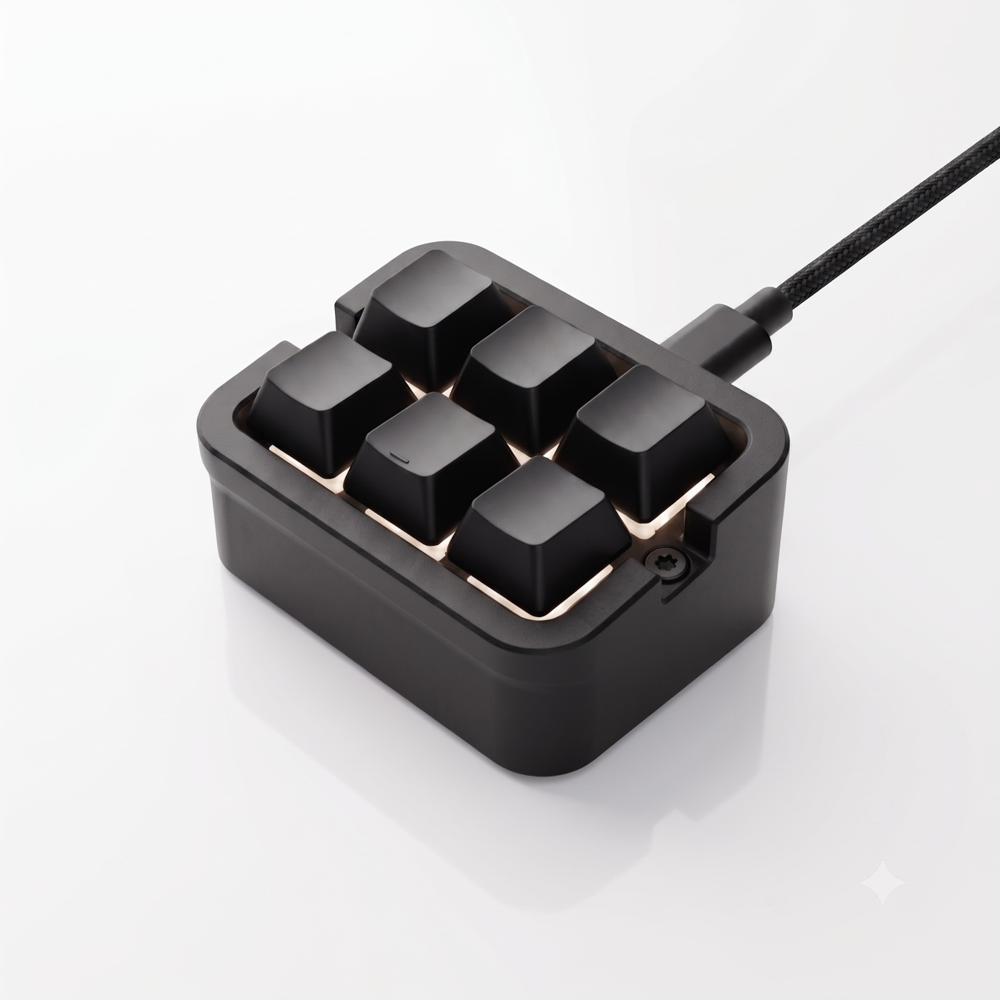

<p align="center">
  
</p>

# MKYADA

**M**acro **K**eyboard **Y**ou **A**lways **D**ream **A**bout — an open-source, DIY **6-key macro keypad** built on the Waveshare **RP2040-Zero**, with a cross-platform desktop configurator. It records your mouse and keyboard, then replays them as **real hardware HID input** — so your macros work even in games that ignore software automation.

<p align="center">
  
</p>

```
┌──────────────┐   serial (JSON-lines)    ┌───────────────┐    USB HID     ┌───────────┐
│  MKYADA App  │ ◄──────────────────────► │  RP2040-Zero  │ ─────────────► │  Your PC  │
│ (Tauri, W/M/L)│   CIRCUITPY drive (JSON) │   (firmware)  │  kbd + mouse   │  / game   │
└──────────────┘ ────────────────────────► └───────────────┘                └───────────┘
```

## Why MKYADA?

Unlike most DIY macro pads that just remap keys, MKYADA plays back **full recorded macros — mouse movements, clicks, scrolls and keystrokes — as real hardware HID input** from the device itself. Software macro tools inject input at the OS level and often don't work inside games; MKYADA's input is indistinguishable from a physical keyboard and mouse because, electrically, that's what it is.

## Features

**On the keypad (no app needed):**
- **Standalone playback** — macros live as JSON files on the board's own USB drive. Drop `macros/key1.json` on, press the key. Works on any PC, no software installed.
- **Everything is JSON** — even a plain Ctrl+A binding is a tiny macro file. Copy it to another board and it behaves identically.
- **Layers** — dedicate one key as a layer switch (toggle or hold): 4 keys become 3×3 = 9 macros (`key1.json`, `key1-b.json`, `key1-c.json`).
- **Loop mode** — `repeat: 0` plays a macro until you press its key again (grinding, fishing, inventory runs…). Same key also **panic-stops** any running macro.
- **Status LED** — the onboard RGB LED shows the active layer, playback, host mode and errors.
- **Absolute mouse positioning** — clicks land on screen coordinates, not relative nudges, via a custom HID descriptor proven in-game.

**In the desktop app (Windows / macOS, Linux planned):**
- **Point-and-click key setup** — click a key, press the shortcut you want (single keys, combos, text snippets, media keys), save. Live key test shows every physical press.
- **Macro recorder & editor** — record globally with F8, then edit every event: coordinates, delays, durations; straighten or simplify mouse paths; draw the path 1:1 on your real screen to verify click positions.
- **Per-app profiles** — with the app running, key 1 can be *Save As* in Photoshop and an inventory macro in your game. No matching profile? The keypad falls back to its own on-board config within 5 seconds.
- **In-app firmware updates**, wrong-solder-order key remapping, device nicknames, multi-device support, light/dark theme, and a GitHub release check on launch.

## Hardware

| Component | Details |
|---|---|
| Microcontroller | [Waveshare RP2040-Zero](https://www.waveshare.com/wiki/RP2040-Zero) — dual-core Cortex-M0+ @ 133 MHz, 264 KB RAM, 2 MB flash, USB-C |
| Firmware | [CircuitPython](https://circuitpython.org/board/waveshare_rp2040_zero/) 10.x + MKYADA firmware ([firmware/](firmware/)) |
| Switches | up to 6 × Cherry MX-compatible, one leg each to **GP0…GP5**, other legs daisy-chained to a common **GND** — no diodes, no resistors |
| Status LED | onboard WS2812 (GP16), nothing to wire |
| Case | 3D-printed **Stream Cheap** remix — STLs + print notes in [hardware/case/](hardware/case/) |

Full soldering walkthrough with the board pinout photo: **[hardware/wiring.md](hardware/wiring.md)**. Fewer than 6 keys is fine — the setup wizard adapts. Soldered the keys in the wrong order? The app remaps them in software.

## How it works

- **Standalone mode** (default): the keypad reads `config.json` + `macros/keyN.json` from its own `CIRCUITPY` drive and plays macros through its USB HID interfaces. The desktop app is a *configurator*, not a runtime.
- **Host mode**: while the desktop app is running and a per-app profile matches, key presses stream to the app over serial (JSON-lines) and the app decides what to play — **still through the keypad's hardware HID**. If the app disappears, a 5-second watchdog returns the keypad to standalone.
- **Bulk data never crosses the serial port** — the app writes macro/config files to the USB drive (the same path as configuring by hand), then tells the firmware to reload.

Details: [docs/macro-format.md](docs/macro-format.md) · [docs/serial-protocol.md](docs/serial-protocol.md)

## Quick start

1. **Flash the firmware** — put CircuitPython on the RP2040-Zero, then copy the contents of the `mkyada-firmware-*.zip` from the [latest release](https://github.com/asilbalaban/MKYADA/releases/latest) onto the `CIRCUITPY` drive. Step-by-step: [docs/firmware-install.md](docs/firmware-install.md).
2. **Install the app** from the [latest release](https://github.com/asilbalaban/MKYADA/releases/latest) (Windows `setup.exe`, macOS universal `.dmg`) and follow the setup wizard — **or** skip the app entirely and copy macro JSON files onto the drive by hand.
3. **Press a key.**

> **macOS:** the app is not notarized, so the first launch is blocked with
> *"Apple could not verify MKYADA…"*. Clear the quarantine flag once and open
> it normally:
>
> ```sh
> xattr -cr /Applications/MKYADA.app
> ```
>
> (Alternative: System Settings → Privacy & Security → **Open Anyway**.
> Details in [docs/macos-install.md](docs/macos-install.md).)

## Repository layout

| Path | What it is |
|---|---|
| [app/](app/) | Desktop configurator — Tauri v2, React + TypeScript frontend, Rust backend |
| [firmware/](firmware/) | CircuitPython firmware for the RP2040-Zero |
| [hardware/](hardware/) | [Soldering guide](hardware/wiring.md) + [3D-printable case](hardware/case/) |
| [docs/](docs/) | [Macro format](docs/macro-format.md) · [Serial protocol](docs/serial-protocol.md) · [Firmware install](docs/firmware-install.md) · [macOS install](docs/macos-install.md) |
| [community-macros/](community-macros/) | Macro gallery — contributions welcome via PR |
| [tests/](tests/) | Firmware simulation tests + editor model tests (run in CI) |

## Building from source

```sh
# App (needs Node 20+ and Rust)
cd app && npm install && npm run tauri dev

# Tests
python3 tests/firmware_sim_test.py
npx tsx tests/model_test.ts
```

## Status

**v0.2.1** — firmware and app verified on real hardware (two boards). Light/dark themed app with onboarding, press-to-capture key assignment, macro recorder/editor with on-screen path overlay, per-app profiles, in-app firmware updates and release checks. CI publishes a Windows installer + macOS universal DMG per release; Linux packages are next.

> **Note:** automating input in online games may violate their Terms of Service. You are responsible for how you use this device.

---

## Credits

The 3D-printed case is a **Stream Cheap** remix — huge thanks to the makers:

- [Stream Cheap (Mini Macro Keyboard)](https://www.printables.com/model/157035-stream-cheap-mini-macro-keyboard) by **dmadison** — the original design.
- [Stream Cheap 3x2 RP2040 Zero](https://www.printables.com/model/989881-stream-cheap-3x2-rp2040-zero) by **schichtbude** — the RP2040-Zero fork whose body we print.
- [Stream Cheap (3x2, 4x2, 5x2) Remixed with reset button](https://www.thingiverse.com/thing:4497991) by **hartk1213** (CC BY 4.0) — source of the 3×2 face plate. Tip: scale the plate's thickness up ~20% in your slicer; it's a little thin as published.

STLs and print notes live in [hardware/case/](hardware/case/).

## Türkçe

**MKYADA** (Macro Keyboard You Always Dream About), Waveshare RP2040-Zero üzerine kurulu, açık kaynak, kendin-yap 6 tuşlu bir makro klavyedir ve çok platformlu bir masaüstü yapılandırma uygulamasıyla gelir.

Çoğu DIY makro pad sadece tuş atar; MKYADA ise kaydedilmiş **mouse hareketleri + tıklamalar + tuş vuruşlarını gerçek donanım HID girdisi olarak** kartın kendisinden oynatır. Yazılımsal makro araçları girdiyi işletim sistemi seviyesinde enjekte ettiği için oyunlarda çoğu zaman çalışmaz; MKYADA'nın girdisi elektriksel olarak gerçek bir klavye/mouse olduğundan ayırt edilemez.

**Donanım:** Waveshare RP2040-Zero (USB-C) + en fazla 6 mekanik switch. Her switch'in bir bacağı sırasıyla **GP0…GP5**'e, diğer bacağı **ortak GND** zincirine lehimlenir — diyot/direnç yok. Kart üzerindeki RGB LED durum ışığıdır. Lehim rehberi (fotoğraflı, Türkçe özetli): [hardware/wiring.md](hardware/wiring.md) · 3D baskı kutu: [hardware/case/](hardware/case/).

- **Uygulamasız çalışır** — `key1.json` dosyasını kartın USB sürücüsüne at, tuşa bas.
- **Her şey JSON** — basit bir Ctrl+A ataması bile küçük bir makro dosyasıdır; başka karta kopyalayınca aynı davranır.
- **Layer desteği** — bir tuşu layer anahtarı yap: 4 tuş → 3×3 = 9 makro.
- **Döngü modu** — `repeat: 0` ile makro, tuşa tekrar basılana kadar çalar; aynı tuş çalan makroyu anında durdurur (panik durdurma).
- **Uygulamaya özel profiller** — masaüstü uygulaması açıkken tuş 1 Photoshop'ta *Save As*, oyunda envanter makrosu olabilir.
- **Kaydet & düzenle** — klavye + mouse kaydı, event bazında düzenleme, mouse yolunu gerçek ekranda 1:1 çizme, hız / tekrar ayarı.
- **Kendin yap** — 6 switch'i RP2040-Zero'ya lehimle, kutuyu 3D yazıcıda bas, firmware'i yükle.

Kurulum: RP2040-Zero'ya CircuitPython yükleyin, firmware release zip içeriğini `CIRCUITPY` sürücüsüne kopyalayın ([docs/firmware-install.md](docs/firmware-install.md)), uygulamayı [son sürümden](https://github.com/asilbalaban/MKYADA/releases/latest) kurun veya JSON dosyalarını elle sürücüye atın.

> **Not:** Çevrimiçi oyunlarda girdi otomasyonu oyunun kullanım koşullarını ihlal edebilir. Cihazı nasıl kullandığınızın sorumluluğu size aittir.
