<p align="center">
  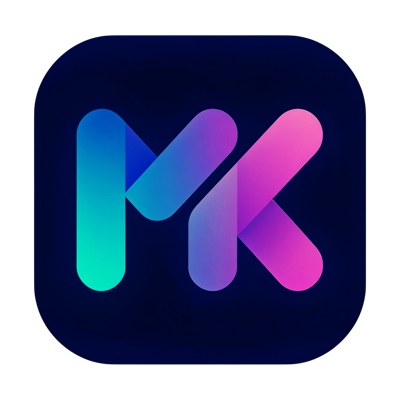
</p>

# MKYADA

**M**acro **K**eypad **Y**ou **A**lways **D**ream **A**bout — an open-source, DIY **macro keypad** (6 keys in the reference build, up to 20 supported) built on the Waveshare **RP2040-Zero**, with a cross-platform desktop configurator. It records your mouse and keyboard, then replays them as **real hardware HID input** — so your macros work even in games that ignore software automation.

**Two models, one firmware and one app:** the **Core 6** is the clean screenless keypad (RGB LED + a layer key); the **Vision 6** adds a 128×64 OLED and an EC11 rotary wheel so you can read macro names, switch layers and tune settings right on the device. See [docs/models.md](docs/models.md).

<p align="center">
  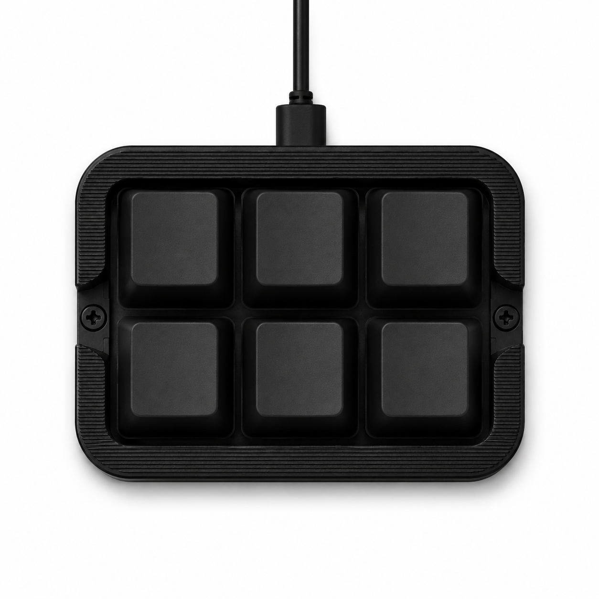
  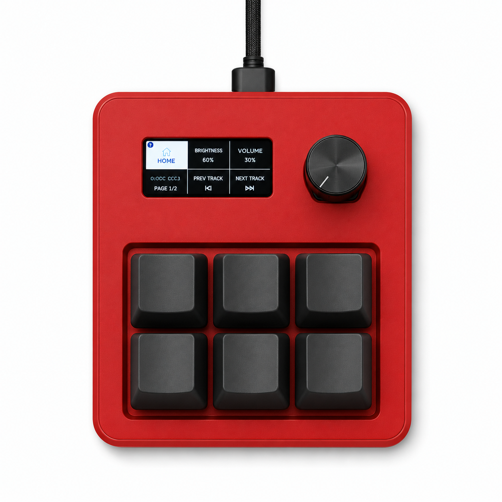
</p>

```
+----------------+   serial (JSON-lines)    +---------------+    USB HID    +-----------+
|   MKYADA App   | <----------------------> |  RP2040-Zero  | ------------> |  Your PC  |
| (Tauri, W/M/L) | CIRCUITPY drive (JSON)   |   (firmware)  | kbd + mouse   |   / game  |
+----------------+ ---------------------->  +---------------+               +-----------+
```

**One repo for everything.** Build the hardware, flash the firmware, create macros, load them onto your keypad, fine-tune your recordings, and keep both the app and the firmware up to date — it all lives here.

## What do you want to do?

| I want to… | Where |
|---|---|
| **Build the keypad** (solder switches, print the case) | [hardware/wiring.md](hardware/wiring.md) · [hardware/case/](hardware/case/) |
| **Flash the firmware** on a fresh board | [docs/firmware-install.md](docs/firmware-install.md) |
| **Update the firmware** later | one click in the app (*Devices → Update firmware*) — it ships inside the app |
| **Put an action on a key** (key, combo, text, media, launch app/file/URL, run a command, play a sound, call a webhook, or a multi-step sequence) | app → *Keys*: click the key, press the shortcut or pick an action, save |
| **Give one key three jobs** (tap / double-press / hold) | app → *Keys*: open the key's variants and assign each gesture |
| **Record a full mouse + keyboard macro** | app → *Recorder*: F8 to record, assign to a key |
| **Fine-tune a recording** | app → *Recorder*: edit every event, multi-select rows, draw the path 1:1 on your screen, pin the app above your game |
| **Different actions per application** | app → *Profiles* (e.g. Save As in Photoshop, inventory macro in your game) |
| **Configure without installing anything** | drop `macros/key1.json` onto the keypad's USB drive — [format](docs/macro-format.md) |
| **Update the app** | *Settings → About → Check for updates* (it also checks on launch) |
| **Share or grab ready-made macros** | [community-macros/](community-macros/) — PRs welcome |

## Why MKYADA?

Unlike most DIY macro pads that just remap keys, MKYADA plays back **full recorded macros — mouse movements, clicks, scrolls and keystrokes — as real hardware HID input** from the device itself. Software macro tools inject input at the OS level and often don't work inside games; MKYADA's input is indistinguishable from a physical keyboard and mouse because, electrically, that's what it is.

## Features

**On the keypad (no app needed):**
- **Standalone playback** — macros live as JSON files on the board's own USB drive. Drop `macros/key1.json` on, press the key. Works on any PC, no software installed.
- **Everything is JSON** — even a plain Ctrl+A binding is a tiny macro file. Copy it to another board and it behaves identically.
- **Tap · double-press · hold** — one key, three independently assignable actions. The firmware resolves the gesture itself, so it still works with no app running. No double-press assigned? Zero added latency on the tap.
- **Layers** — dedicate one key as a layer switch (toggle or hold): 4 keys become 3×3 = 9 macros (`key1.json`, `key1-b.json`, `key1-c.json`). A live layer badge in the app always shows which one is active. An assignable **"Go to layer X"** action jumps straight to a layer (works on the Core 6 too); the Vision 6 switches layers with the wheel, no key spent.
- **Loop mode** — `repeat: 0` plays a macro until you press its key again (grinding, fishing, inventory runs…). Same key also **panic-stops** any running macro.
- **Status LED** — the onboard RGB LED shows the active layer, playback (fast blink; slow blink while looping), host mode and errors — and can mirror app-side state like "mic muted".
- **Absolute mouse positioning** — clicks land on screen coordinates, not relative nudges, via a custom HID descriptor proven in-game.
- **Self-healing connection** — dead/reset serial ports and read-only drives are detected and recovered from automatically; nicknames are stored on the device itself so they follow it between computers.
- **MIDI out** — the keypad is a **USB MIDI device as well as a keyboard**, so a key can send a note, control change or program change straight into a DAW with nothing running on the computer. Notes are *momentary* by default (the note lasts exactly as long as the key is held — what Ableton's Looper and drum-rack pads need). A Mackie Control picker gives Logic and Pro Tools transport with no mapping at all. Nothing else at this price does both jobs: mini MIDI controllers can't send shortcuts, and stream decks can't send MIDI. Off by default — turn it on in *Settings → Keypad*.
- **Finished-product mode** — an optional setting (app → *Settings → Keypad*) hides the keypad's USB drive entirely: no flash drive, no raw JSON in sight. The app keeps full access over the serial connection. Hold key 1 while plugging in to bring the drive back.

**On the Vision 6 (screen model):**
- **On-device menu system** — a 128×64 OLED shows your six live macro names, a layer picker, a per-macro speed editor (0.1×–10.0×) and a settings menu, all driven by the **EC11 rotary wheel** with BACK/CONFIRM. No app required to read or tune your keypad.
- **Encoder + nav buttons as macro slots** — the wheel (→ / ←), its push, and BACK/CONFIRM each carry their own assignable action, per layer and per context. Great for volume, scroll/zoom or scene switching.
- **The Dial** — a key can open a **six-slot encoder toolset** on the screen: the six keys pick a slot, the wheel drives it. Slots send shortcut pairs, scroll, a relative mouse drag (for controls with no shortcut, like DaVinci's color wheels) or **MIDI CC**. Ready-made sets ship for Resolve, Premiere, Final Cut, Photoshop, Ableton, Logic, Reaper, FL Studio, a MIDI mixer and a sheet-music page turner. Fully device-native — it works with the app closed.
- **Browse and reassign on the device** — select a key and press the wheel: media and MIDI keys open a browser. Turn to walk the options (all 128 notes for MIDI), **tap to hear the highlighted one**, hold to reassign the key to it. The keypad writes its own macro, so it sticks with no app involved.
- **On-screen bands** — optional strips name the active **layer** and the desktop app's active **per-app profile**; the auto-return timeout is adjustable on the device or in the app. See [docs/vision6.md](docs/vision6.md).

**In the desktop app (Windows / macOS, Linux planned):**
- **Point-and-click key setup** — click a key, press the shortcut you want (single keys, combos, text snippets, media keys), save. Live key test shows every physical press.
- **Beyond keystrokes** — put a key to launching an app, file or URL, running a terminal command, playing a sound (tap to play; hold to stop, fade out, or restart it), scrolling/zooming (wheel + modifiers), controlling your microphone (mute/unmute/toggle/**push-to-talk**), driving **OBS Studio** over obs-websocket (scene, record, stream, mic, virtual cam), or calling a webhook — a fully custom HTTP request (method, headers, body) for smart lights, Discord/Telegram messages, Home Assistant and anything else with an HTTP API. Chain several of these into one multi-step sequence with delays in between. Full list: [docs/actions.md](docs/actions.md).
- **Macro recorder & editor** — record globally with F8, then edit every event: coordinates, delays, durations; straighten or simplify mouse paths; draw the path 1:1 on your real screen to verify click positions; multi-select rows with shift/cmd-click; full undo/redo.
- **Per-app profiles** — with the app running, key 1 can be *Save As* in Photoshop and an inventory macro in your game. No matching profile? The keypad falls back to its own on-board config within 5 seconds.
- **Runs in the background** — closing the window sends MKYADA to the system tray instead of quitting, so key actions and profiles keep working; an optional "start at login" setting launches it automatically.
- **Live system status** — a settings strip shows CPU, RAM and mic-mute state at a glance, with an optional rule to turn the keypad's LED red while the mic is muted.
- **In-app firmware updates**, wrong-solder-order key remapping, device nicknames, multi-device support, light/dark theme, and a GitHub release check on launch.

## The app

| Assign keys (Vision 6) | Manage devices |
|---|---|
| 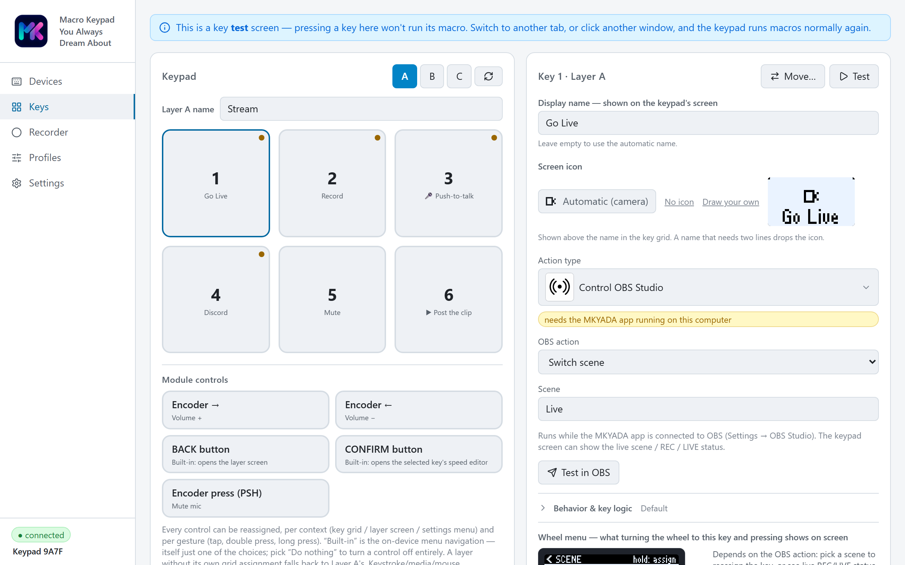 | 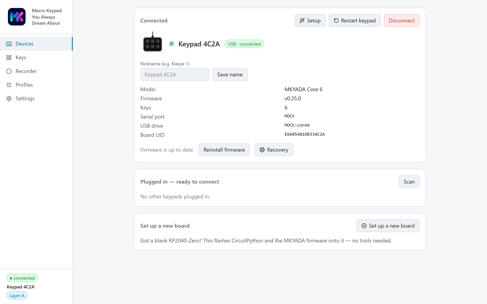 |
| **Record & edit macros** | **Per-app profiles** |
| 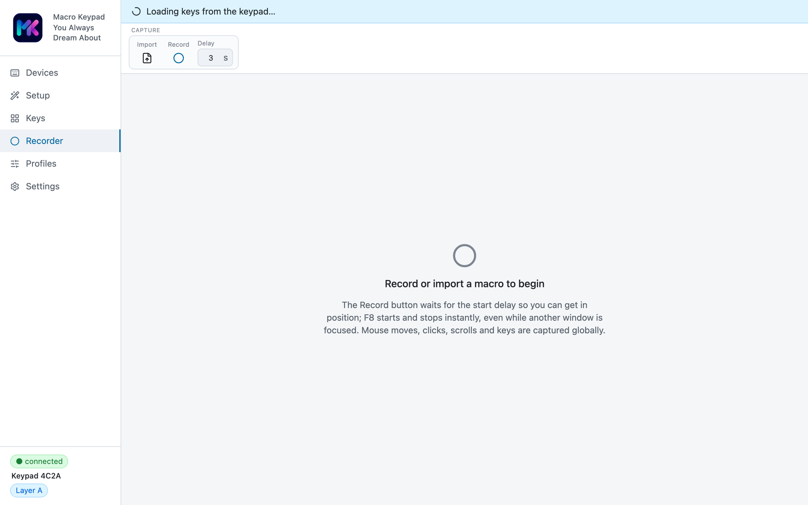 | 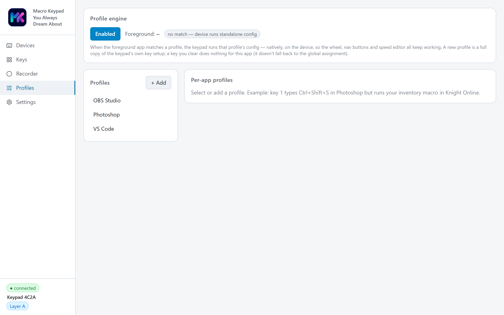 |
| **Setup at a glance** | **Settings — grouped into tabs** |
| 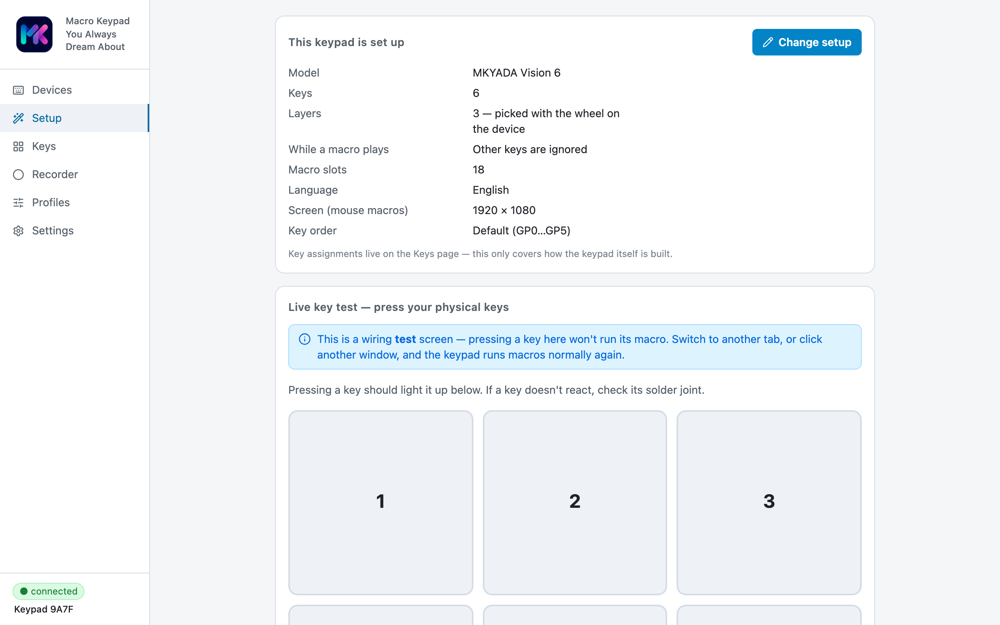 | 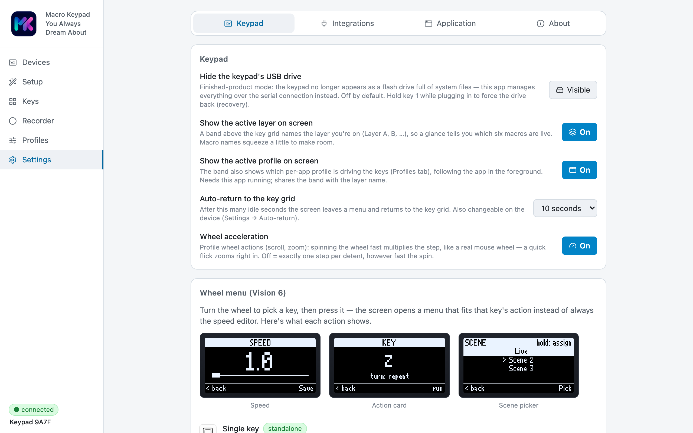 |

The Vision 6's own OLED screens. These are not mockups: `scripts/render-oled.py`
runs the firmware's drawing code over the font the device flashes, so every lit
pixel here is a pixel the SH1106 lights. The whole menu also runs in a browser —
open [`docs/simulator.html`](docs/simulator.html) to drive the keys, wheel and
buttons without a board, browse the 270-icon family, and inspect the font. That
page draws with the app's own modules (`app/src/lib/oled-*.ts`, bundled in by
`scripts/build-demo.mjs`), and those are held to the firmware's pixels by
`tests/golden/*.txt` — so the browser, the desktop app and the keypad cannot
show three different menus.

<p align="center">
  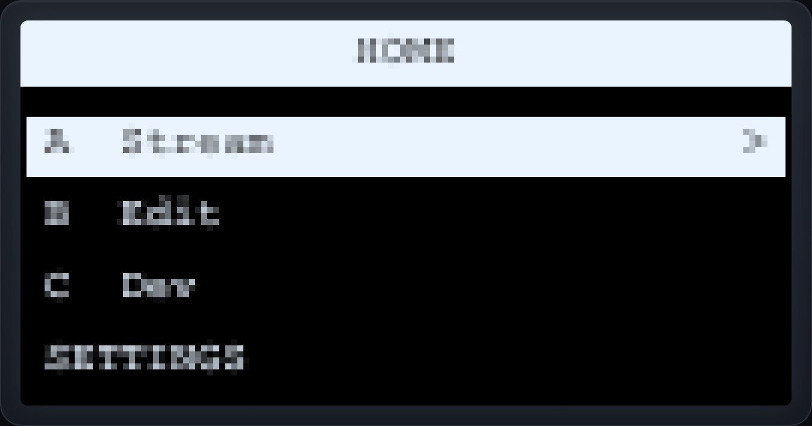
  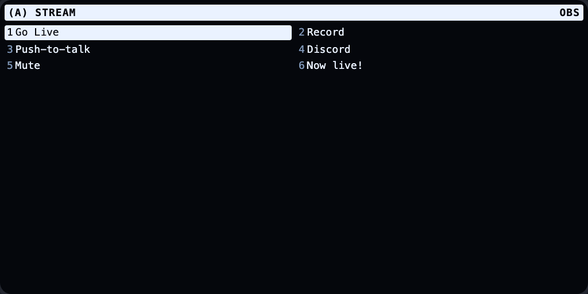
  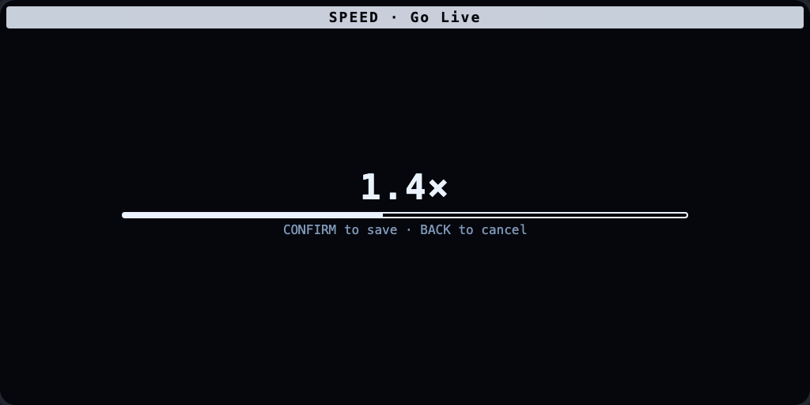
  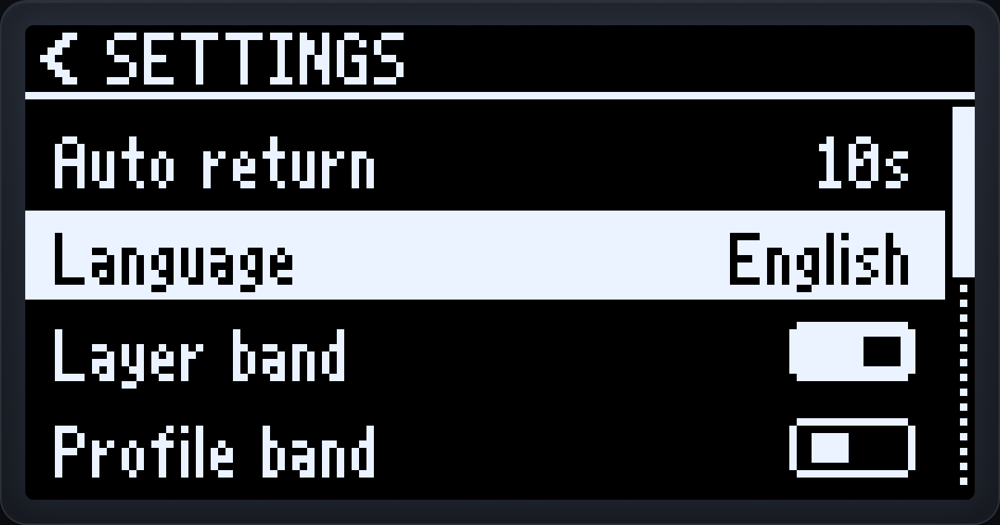
  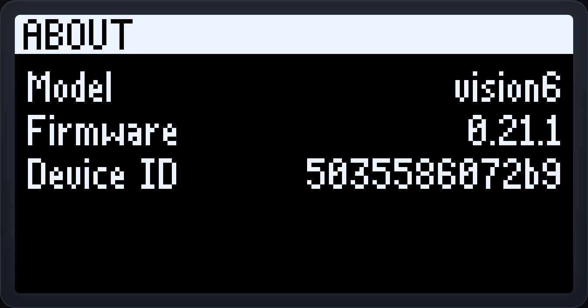
</p>
<p align="center">
  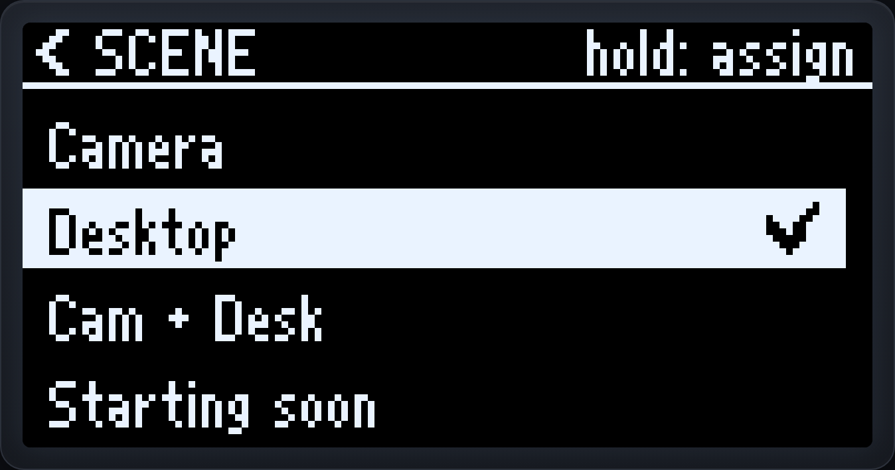
  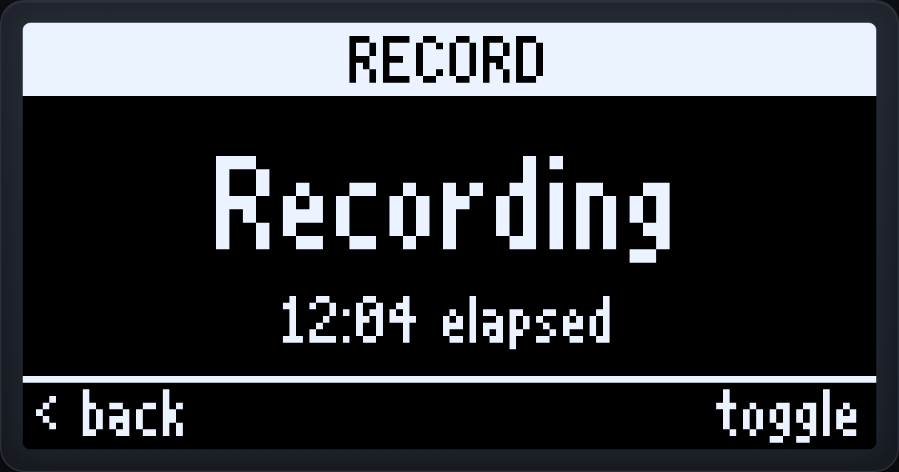
  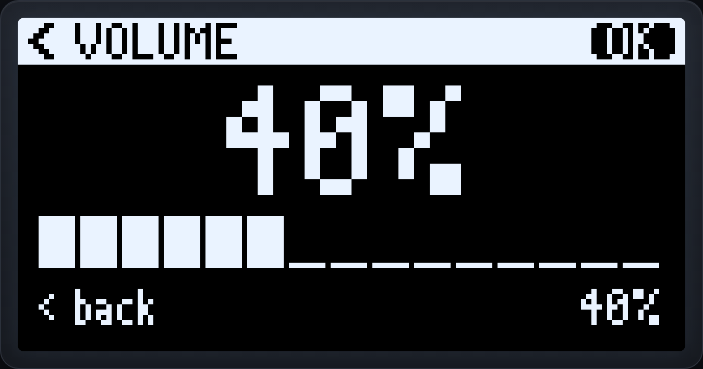
  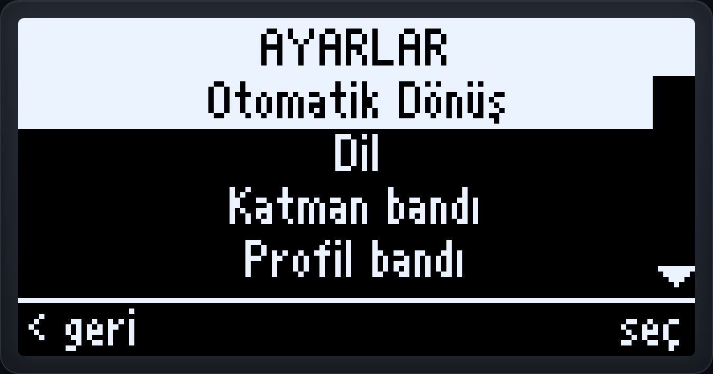
</p>

## Hardware

| Component | Details |
|---|---|
| Microcontroller | [Waveshare RP2040-Zero](https://www.waveshare.com/wiki/RP2040-Zero) — dual-core Cortex-M0+ @ 133 MHz, 264 KB RAM, 2 MB flash, USB-C |
| Firmware | [CircuitPython](https://circuitpython.org/board/waveshare_rp2040_zero/) 10.x + MKYADA firmware ([firmware/](firmware/)) |
| Switches | 1–20 × Cherry MX-compatible (6 = reference build), one leg each to **GP0, GP1, GP2…** in key order, other legs daisy-chained to a common **GND** — no diodes, no resistors |
| Status LED | onboard WS2812 (GP16), nothing to wire |
| Screen (Vision 6) | SH1106 **128×64 OLED** (I²C, 3V3) + **EC11 rotary encoder** with push + BACK/CONFIRM buttons — wiring in [docs/vision6.md](docs/vision6.md) |
| Case | 3D-printed **Stream Cheap** remix — STLs + print notes in [hardware/case/](hardware/case/) |

<p align="center">
  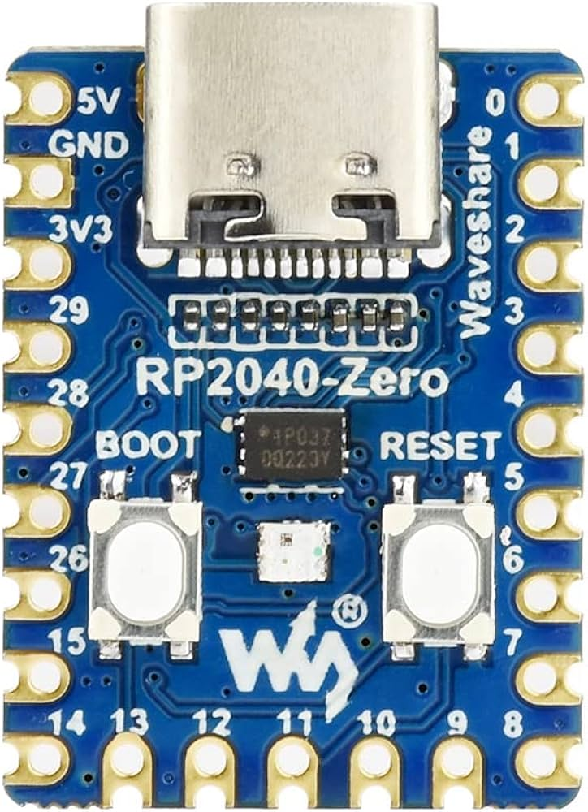
</p>

Full soldering walkthrough with the board pinout: **[hardware/wiring.md](hardware/wiring.md)**. Any key count from 1 to 20 works — the setup wizard adapts. Soldered the keys in the wrong order? The app remaps them in software.

## How it works

- **Standalone mode** (default): the keypad reads `config.json` + `macros/keyN.json` from its own `CIRCUITPY` drive and plays macros through its USB HID interfaces. The desktop app is a *configurator*, not a runtime.
- **Host mode**: while the desktop app is running and a per-app profile matches, key presses stream to the app over serial (JSON-lines) and the app decides what to play — **still through the keypad's hardware HID**. If the app disappears, a 5-second watchdog returns the keypad to standalone.
- **Bulk data never crosses the serial port** — the app writes macro/config files to the USB drive (the same path as configuring by hand), then tells the firmware to reload.

Details: [docs/macro-format.md](docs/macro-format.md) · [docs/serial-protocol.md](docs/serial-protocol.md)

## Quick start

1. **Install the app** from the [latest release](https://github.com/asilbalaban/MKYADA/releases/latest) (Windows `setup.exe`, macOS universal `.dmg`).
2. **Set up the board — one click.** Plug a blank RP2040-Zero in with **BOOT** held and open **Devices → Set up a new board**: the app flashes CircuitPython, installs the MKYADA firmware and writes a starter config for your model (Core 6 or Vision 6) — no manual UF2 copying, no tools. *(Already flashed, or prefer to do it by hand? The [manual steps](docs/firmware-install.md) still work — copy the `mkyada-firmware-*.zip` contents onto the `CIRCUITPY` drive.)*
3. **Assign keys** in the setup wizard — **or** skip the app entirely and copy macro JSON files onto the drive by hand.
4. **Press a key.**

> **macOS:** the app is not notarized, so the first launch is blocked with
> *"Apple could not verify MKYADA…"*. Clear the quarantine flag once and open
> it normally:
>
> ```sh
> xattr -cr /Applications/MKYADA.app
> ```
>
> (Alternative: System Settings → Privacy & Security → **Open Anyway**.
> Details in [docs/macos-install.md](docs/macos-install.md).)
>
> Granted **Input Monitoring**/**Accessibility** but the app still shows
> **DENIED**? Each unsigned build gets a new code signature, so macOS ties
> the permission to the old one. Reset it and grant again:
> [docs/macos-install.md#permission-shows-on-but-the-app-still-says-denied](docs/macos-install.md#permission-shows-on-but-the-app-still-says-denied)

## Repository layout

| Path | What it is |
|---|---|
| [app/](app/) | Desktop configurator — Tauri v2, React + TypeScript frontend, Rust backend |
| [firmware/](firmware/) | CircuitPython firmware for the RP2040-Zero |
| [hardware/](hardware/) | [Soldering guide](hardware/wiring.md) + [3D-printable case](hardware/case/) |
| [docs/](docs/) | [Models](docs/models.md) · [Key actions](docs/actions.md) · [Use cases](docs/use-cases.md) · [Vision 6](docs/vision6.md) · [Macro format](docs/macro-format.md) · [Serial protocol](docs/serial-protocol.md) · [Firmware install](docs/firmware-install.md) · [macOS install](docs/macos-install.md) |
| [community-macros/](community-macros/) | Macro gallery — contributions welcome via PR |
| [tests/](tests/) | Firmware simulation tests + editor model tests (run in CI) |

## Building from source

```sh
# App (needs Node 20+ and Rust)
cd app && npm install && npm run tauri dev

# Tests
python3 tests/firmware_sim_test.py
npx tsx tests/model_test.ts
```

## Status

**v0.21.x** — two hardware models (**Core 6** screenless, **Vision 6** OLED + encoder) on one firmware and one app, verified on real hardware. Light/dark themed app with onboarding, press-to-capture key assignment, a full macro recorder/editor with on-screen path overlay and undo/redo, per-app profiles that run **natively on the device** (a full config copy), and a broad key-action set: keystroke/combo/text/media, mouse scroll & zoom, launch/command/sound, microphone (incl. push-to-talk), **OBS Studio** control, webhooks, multi-step sequences, and "go to layer X". Tap/double-press/hold key logic with playback policies (stop/restart, hold-to-repeat, loop). Vision 6 adds an on-device menu (layer picker, per-macro speed editor, settings), on-screen layer/profile bands, and encoder/nav-button macro slots. A provisioning wizard flashes blank RP2040-Zero boards; firmware updates are one-click and unbrickable (rescue console, locked update mode). System tray + autostart, full keyboard-layout awareness (Turkish and any other layout), in-app firmware updates and release checks. CI publishes a Windows installer + macOS universal DMG per release; Linux packages are next.

> **Note:** automating input in online games may violate their Terms of Service. You are responsible for how you use this device.

---

## Credits

The 3D-printed case is a **Stream Cheap** remix — huge thanks to the makers:

- [Stream Cheap (Mini Macro Keyboard)](https://www.printables.com/model/157035-stream-cheap-mini-macro-keyboard) by **dmadison** — the original design.
- [Stream Cheap 3x2 RP2040 Zero](https://www.printables.com/model/989881-stream-cheap-3x2-rp2040-zero) by **schichtbude** — the RP2040-Zero fork whose body we print.
- [Stream Cheap (3x2, 4x2, 5x2) Remixed with reset button](https://www.thingiverse.com/thing:4497991) by **hartk1213** (CC BY 4.0) — source of the 3×2 face plate. Tip: scale the plate's thickness up ~20% in your slicer; it's a little thin as published.

STLs and print notes live in [hardware/case/](hardware/case/).

## Türkçe

**MKYADA** (Macro Keypad You Always Dream About), Waveshare RP2040-Zero üzerine kurulu, açık kaynak, kendin-yap bir makro klavyedir (referans tasarım 6 tuş, 20 tuşa kadar desteklenir) ve çok platformlu bir masaüstü yapılandırma uygulamasıyla gelir.

**İki model, tek bellenim ve tek uygulama:** **Core 6** sade, ekransız klavye (RGB LED + katman tuşu); **Vision 6** ise 128×64 OLED ve EC11 döner tekerlek ekler; böylece makro adlarını okuyup katman değiştirir ve ayarları doğrudan cihaz üzerinde yaparsınız. Ayrıntı: [docs/models.md](docs/models.md).

**Macro oluşturmak, keypad'inize yüklemek, kaydettiğiniz makroyu düzenlemek, sürüm güncellemek — her şey için ihtiyacınız olan tek repo burası:** donanımı kur ([hardware/](hardware/)), firmware'i yükle/güncelle (uygulamadan tek tık), tuşlara aksiyon ata (*Keys*), makro kaydet ve ince ayar yap (*Recorder*), uygulamaya özel profiller kur (*Profiles*), hazır makroları paylaş ([community-macros/](community-macros/)).

Çoğu DIY makro pad sadece tuş atar; MKYADA ise kaydedilmiş **mouse hareketleri + tıklamalar + tuş vuruşlarını gerçek donanım HID girdisi olarak** kartın kendisinden oynatır. Yazılımsal makro araçları girdiyi işletim sistemi seviyesinde enjekte ettiği için oyunlarda çoğu zaman çalışmaz; MKYADA'nın girdisi elektriksel olarak gerçek bir klavye/mouse olduğundan ayırt edilemez.

**Donanım:** Waveshare RP2040-Zero (USB-C) + 1–20 mekanik switch (referans tasarım 6 tuş). Her switch'in bir bacağı sırasıyla **GP0…GP5**'e, diğer bacağı **ortak GND** zincirine lehimlenir — diyot/direnç yok. Kart üzerindeki RGB LED durum ışığıdır. Lehim rehberi (fotoğraflı, Türkçe özetli): [hardware/wiring.md](hardware/wiring.md) · 3D baskı kutu: [hardware/case/](hardware/case/).

- **Uygulamasız çalışır** — `key1.json` dosyasını kartın USB sürücüsüne at, tuşa bas.
- **Her şey JSON** — basit bir Ctrl+A ataması bile küçük bir makro dosyasıdır; başka karta kopyalayınca aynı davranır.
- **Tek dokunuş · çift · basılı tut** — aynı tuşa üç ayrı, bağımsız atanabilir aksiyon; bellenim jesti kendisi çözer, uygulama açık olmasa bile çalışır.
- **Layer desteği** — bir tuşu layer anahtarı yap: 4 tuş → 3×3 = 9 makro. Uygulamadaki canlı rozet o an hangi layer'da olduğunuzu gösterir.
- **Döngü modu** — `repeat: 0` ile makro, tuşa tekrar basılana kadar çalar; aynı tuş çalan makroyu anında durdurur (panik durdurma).
- **Uygulamaya özel profiller** — masaüstü uygulaması açıkken tuş 1 Photoshop'ta *Save As*, oyunda envanter makrosu olabilir.
- **Tuş vuruşunun ötesinde** — bir tuşu uygulama/dosya/URL açmaya, terminal komutu çalıştırmaya, ses çalmaya (basılı tutunca durdur/kıs/baştan başlat), kaydırma & yakınlaştırmaya, mikrofon kontrolüne (sustur/aç/değiştir/**bas-konuş**), **OBS Studio** kontrolüne (sahne, kayıt, yayın, mikrofon) ya da webhook'a atayın; birkaçını aralarında bekleme ile zincirleyerek tek bir çok adımlı aksiyon yapın. Tüm liste: [docs/actions.md](docs/actions.md).
- **Vision 6 ekranı** — 128×64 OLED'de canlı makro adları, katman seçici, makro başına hız ayarı ve ayarlar menüsü; hepsi döner tekerlekle. Encoder ve BACK/CONFIRM tuşları da kendi makrolarını taşır. Ayrıntı: [docs/vision6.md](docs/vision6.md).
- **Kaydet & düzenle** — klavye + mouse kaydı, event bazında düzenleme, çoklu satır seçimi, geri al/ileri al, mouse yolunu gerçek ekranda 1:1 çizme, hız / tekrar ayarı.
- **Arka planda çalışır** — pencereyi kapatmak uygulamayı kapatmaz, sistem tepsisine gönderir; tuş aksiyonları ve profiller çalışmaya devam eder. İsteğe bağlı "açılışta başlat" seçeneği de var.
- **Kendin yap** — 6 switch'i RP2040-Zero'ya lehimle, kutuyu 3D yazıcıda bas, firmware'i yükle.

Kurulum: RP2040-Zero'ya CircuitPython yükleyin, firmware release zip içeriğini `CIRCUITPY` sürücüsüne kopyalayın ([docs/firmware-install.md](docs/firmware-install.md)), uygulamayı [son sürümden](https://github.com/asilbalaban/MKYADA/releases/latest) kurun veya JSON dosyalarını elle sürücüye atın.

> **Not:** Çevrimiçi oyunlarda girdi otomasyonu oyunun kullanım koşullarını ihlal edebilir. Cihazı nasıl kullandığınızın sorumluluğu size aittir.
