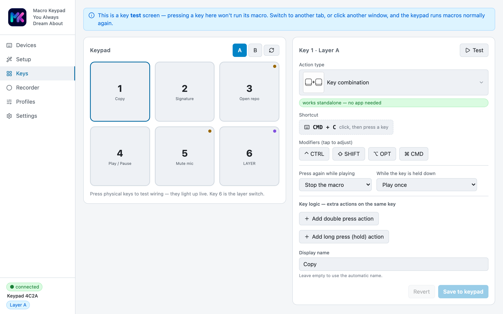

# Use cases

Real setups that show what MKYADA does — mix and match the [key
actions](actions.md), [layers](models.md), and [per-app profiles](../README.md).
Both models can do all of these; the notes call out where the **Vision 6**
screen and encoder make it nicer.

## 1. Streaming

Go live without alt-tabbing. Keys switch OBS scenes, toggle recording, and fire
a "we're live" webhook to your Discord; a **push-to-talk** key unmutes only
while held. On the Vision 6, the **encoder** rides volume and the OLED shows the
current scene / REC / LIVE at a glance.

> Actions: OBS Studio · Microphone (push-to-talk) · Webhook · Media
> · Vision 6 encoder for volume.

## 2. Photo & video editing

Bind the shortcuts your hands never remember — undo/redo, save, export, brush
sizes — and record a repetitive retouch as a macro that plays back 1:1. The
Vision 6 **wheel** scrubs the timeline or zooms (mouse-scroll with a modifier),
with **wheel acceleration** so a fast flick jumps further.

> Actions: Shortcut · Recorded macro · Mouse scroll (+modifier) · Sequence.

## 3. Development

One key runs your build, another runs the tests, a third opens the PR. Text
snippets drop in boilerplate; **launch** opens the repo or localhost. With
**per-app profiles**, the same six keys mean different things in VS Code, the
terminal, and the browser — automatically, following the foreground app.

> Actions: Run command · Launch · Text snippet · Per-app profiles.

## 4. Gaming

Software macro tools inject fake events that anti-cheat and secure apps ignore.
MKYADA **is** a keyboard and mouse — every keystroke, click and mouse path is
genuine USB hardware input. Put a combo or a recorded rotation on a key and it
plays exactly like your own hands. Use [layers](models.md) to fit a whole
loadout onto six keys.

> Actions: Shortcut · Recorded macro · Layers · Go-to-layer.

## 5. Meetings & working from home

A mute/unmute key you can find without looking, a "join" launch for your meeting
link, a webhook that flips a **do-not-disturb** light on the wall, and a key
that opens the camera app. The Vision 6 shows which layer/profile is live so you
never guess.

> Actions: Microphone · Launch · Webhook · Layers.

## 6. Everyday productivity layers

Six keys become dozens. Layer A is your desktop essentials, layer B is
smart-home and shell, layer C is app launchers. On the **Core 6** a dedicated
layer key cycles them; the assignable **"Go to layer X"** action jumps straight
to one. On the **Vision 6** you turn the wheel and read the layer name on screen.

> Actions: Layers · Go-to-layer · Launch · Shortcut · Play sound.
