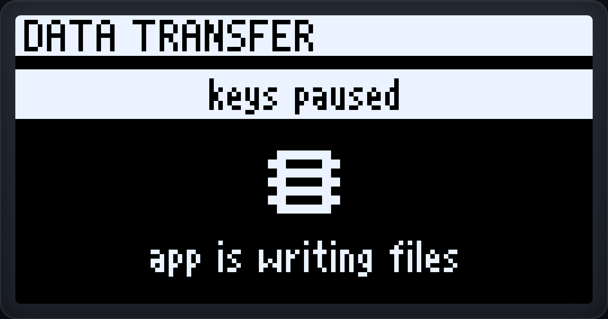

# MKYADA Vision 6 (OLED + encoder model)

The Vision 6 is the screen model: an SH1106 128×64 OLED, an EC11 rotary
encoder with push, BACK/CONFIRM buttons, six macro keys and the on-board
RGB LED, all on a Waveshare RP2040-Zero. It runs the same firmware as the
Core 6 — `config.json "model": "vision6"` selects the variant (a blank,
config-less board auto-detects the display once at boot).

## Wiring

Bring-up-verified pinout (mirrors `hardware/oled-bringup/SCHEMATIC.md`):

| Function | Pin | Notes |
|---|---|---|
| OLED SDA | GP0 | I2C 0x3C @ 400 kHz — **3V3 only**, never 5 V |
| OLED SCL | GP1 | |
| Encoder A (TRA) | GP2 | EC11, common to GND |
| Encoder B (TRB) | GP3 | |
| Encoder push (PSH) | GP4 | active low, internal pull-up |
| BACK button | GP5 | active low |
| CONFIRM button | GP6 | active low |
| Macro key 1 | GP29 | also the **recovery key** (hold while plugging in to un-hide the USB drive) |
| Macro key 2 | GP28 | |
| Macro key 3 | GP27 | |
| Macro key 4 | GP26 | |
| Macro key 5 | GP15 | |
| Macro key 6 | GP14 | |
| RGB LED | GP16 | on-board WS2812 |

A key soldered to a different GPIO is fine — assign it in the app under
**Devices → Setup → Wiring** (writes `config.json "pins"`).

Runtime: CircuitPython **10.2.x** (the tier the display stack is validated
on). The firmware zip / app installer ships every needed library (`lib/`)
and the screen font (`fonts/mkyada.fnt`, 716 bytes).

Since firmware **0.20.0** the display draws into one resident framebuffer
using MKYADA's own bitmap font, instead of building `displayio` Labels over
BDF fonts per screen. Measured on the board, ten full repaints now allocate
48 bytes in total; the font and text libraries the bundle used to carry went
from 248 KB to 716 bytes, and Turkish letters are drawn rather than folded to
ASCII. Free heap on a running board went from a median 14 KB to 56 KB. See the FONT tab of [the demo page](simulator.html).

**0.21.0** made the repaints incremental: a menu detent or a turn of the speed
editor redraws only the rows that changed, so displayio's push shrinks with
them — 104 ms to 51 ms end to end for a detent, measured on the board. The
`font` field left `config.json` and `hello` in the same release (protocol v10),
and updating from 0.19.0 or earlier now deletes the BDF fonts and the two
Adafruit text libraries from the board, reclaiming about 248 KB of its 1 MB
flash.

## Screens & controls

**Try the menu in a browser: [simulator.html](simulator.html).** It is not a
mockup, and not a port either: the page runs the desktop app's own drawing
modules, bundled in by `scripts/build-demo.mjs`, so the browser, the app's
editor preview and the keypad cannot show three different menus. The whole menu
(wheel menus, host menus, key test, bands, update/error screens) runs and can be
changed without flashing a board. Two more tabs: **İKONLAR**, the 270-icon
family a macro can pick from, clickable straight onto a grid key so you see it
at 1:1; and **FONT**, which draws any text you type at device scale and shows
every glyph's pixel cost.

Real renders of the 128×64 OLED (layer A, nicknamed "Stream" — the nickname
shows in the grid's band; the layer picker always shows the plain letter) —
produced by
`scripts/render-oled.py`, which drives `firmware/mkyada/oled.py` and the shipped
`mkyada.fnt` through the software displayio in `tests/`, so these are the
device's pixels rather than a drawing of them.

| Home | Grid | Speed | Settings | About |
|---|---|---|---|---|
|  |  |  |  |  |

| Scene picker | Record status | Volume | Turkish | Data transfer |
|---|---|---|---|---|
|  |  |  |  |  |

- **Boot** — branded "MKYADA loading" screen from the first frame; no
  CircuitPython console text.
- **Home** — turn the wheel to scroll layer letters (A…H, as many as
  `layer_count`; a single-layer setup shows just A) plus **SETTINGS**;
  press the wheel or CONFIRM to enter.
- **Grid** (the resting screen) — the active layer's six macro names, read
  from the macro files the app uploads. Turn to select a cell, CONFIRM/push
  to open that key's **speed editor**, BACK for home. Pressing a macro key
  plays it over USB HID and inverts its cell until playback ends.
  With **Layer band** / **Profile band** on (SETTINGS, or the app's
  Settings → Keypad), an inverted strip across the top names the active
  layer and/or the desktop app's active per-app profile — the macro names
  squeeze a little to make room. The profile half needs the app running;
  its label disappears the moment the app disconnects.
- **Speed editor** — 0.1×–10.0× with encoder acceleration; CONFIRM writes
  the value into the macro file itself (`settings.speed`), so the app and
  the device always agree. 2× plays in half the time, 10× in a tenth.
  If the USB drive is visible (recovery boot) the filesystem is host-owned
  and the editor explains instead of saving.
- **SETTINGS** — auto-return timeout (3–60 s), language, the Layer/Profile
  band toggles, wheel paging, key test, pixel test, restart.
  **Key test** shows all six keys at once with a press counter each, plus the
  wheel and the module buttons, so a silent key stands out instead of having to
  be found one press at a time; hold PSH to leave. **Pixel test** lights the
  whole panel so a dead column or a stuck row shows against a solid field —
  nothing on it is readable, so PSH, BACK and CONFIRM all leave.
  Timeout is stored on the board (NVM); language,
  the band toggles and wheel paging live in `config.json` (rewritten
  on-device, like the app does) so the app always shows the same values —
  all three switches are also in the app's Settings → Keypad. All survive power cycles
  and firmware updates.
  The font-size entry is gone as of 0.20.0: one font ships now, and its
  proportional spacing fits more into a grid cell than the old fixed 4×6
  did. The `font` field left `config.json` and `hello` in 0.21.0 (protocol
  v10); a `font` key in an old config file is ignored.
- **Data transfer** (fw 0.25.0) — while the app is reading or writing files
  (a save, a backup, reading the keys back), the keypad shows a locked screen
  and stops responding to its own keys, wheel and buttons. It is not a
  politeness: every repaint costs 100–300 ms in which the USB receive FIFO
  goes undrained, and the chunk that arrives then loses bytes out of its
  middle — a failed save. So the screen is painted exactly twice, once going
  in and once coming out, no matter how many files the operation touches.
  Presses during it are dropped rather than queued. It ends three seconds
  after the last file operation, which is also what recovers the keypad if
  the app dies mid-save.
- **Host mode** (a per-app profile is active) — key, encoder and button
  events stream to the app. Since fw 0.10.0 the screen shows the active
  profile's six key names as a grid (the app pushes them over serial), with
  the band on top if enabled — so you can see what the keys do, not just
  that an app owns them. Falls back to a plain "Connected to app" note on
  older apps.

## Working on the menu

### One drawing, two places it has to look right

The Vision 6's screens exist twice on purpose and nowhere else:

| Where | What it is |
|---|---|
| `firmware/mkyada/oled.py` | the Python that runs on the board |
| `app/src/lib/oled-screens.ts` | the JavaScript the desktop app and the demo page both use |

That second one used to be three separate implementations — one in the app, one
inside `simulator.html`, one inside the font viewer. They drifted, which is the
failure that matters: a demo page that quietly stops matching the keypad is
worse than no demo page, because people trust it. They are now one module, and
the demo page carries a generated bundle of it rather than a copy.

The two survivors are held to each other rather than trusted:

- `tests/oled_render_test.py` renders every screen from the **firmware** into a
  real 128×64 buffer, checks the structural invariants, and writes
  `tests/golden/*.txt`.
- `app/src/lib/oled-draw.test.ts` renders the same inputs through the
  **JavaScript** and demands the same pixels — all 28 screens, both languages.

So a layout change that reaches one side and not the other fails CI. Regenerate
the goldens deliberately with `python3 tests/oled_render_test.py --bless`.

Everything else the screens need is generated from a single source too, each
with a `--check` mode CI runs:

| Source | Generator | Goes to |
|---|---|---|
| `fonts/src/mkyada.txt` | `build-font.mjs` | `firmware/fonts/mkyada.fnt`, `app/src/lib/oled-font.ts` |
| `icons/src/icons.txt` | `build-icons.mjs` | `firmware/mkyada/icons.py`, `app/src/lib/oled-icons.ts` |
| `firmware/mkyada/i18n.py` | `build-oled-i18n.mjs` | `app/src/lib/oled-i18n.ts` |
| `app/src/lib/oled-bundle.ts` | `build-demo.mjs` | the bundle inside `docs/simulator.html` |

The icon source is 270 icons in 21 categories, drawn as ASCII, one 8×8 block
each, packed one byte per row (bit 7 = leftmost pixel) — 2160 bytes, and that
packing *is* the flash layout, so the firmware reads the same bytes without
conversion. A macro picks one by **name** (`"icon": "rocket"` in its JSON),
never by index: names are permanent, so reordering or extending the set can
never repoint a user's macro at a different picture. An unknown name falls back
to the action family's default. One name is reserved: `"icon": "none"` means
**draw nothing**, which is a different thing from having no `icon` field at all
(that one means "the action family chooses") — without it there was no way to
ask for a bare, full-width name on a key whose kind has a default picture.

Since firmware 0.25.0 the field can also be the picture instead of a name:
`"icon": "px:183c7effc3c30000"` is those same eight rows written out in hex,
drawn by hand on the app's 8×8 grid (Keys → the key → **Draw your own**).
`icons.get()` decodes it rather than looking it up, so a drawing needs no
second file and no index — it rides inside the macro it belongs to, travels
with a backup, and goes away with a delete. A malformed one reads as "no icon"
rather than blanking the tile. Icons live under `icons/`, not `fonts/` — they
are their own asset, not glyphs, and `build-font.mjs` compiles every `.txt` it
finds beside the font source.

### Working on the menu, in practice

`docs/simulator.html` is still where a menu change gets tried first — open the
file, no server, no build, and the whole UI runs: six macro keys, the wheel with
push, BACK and CONFIRM, plus a panel that simulates the desktop app (connect,
host mode, OBS record/stream, the read-only USB drive, a firmware update) so the
host-fed wheel menus and the band markers are reachable too.

What is hand-maintained in that file is now only the **state machine** — which
control leads to which screen, the port of `firmware/mkyada/ui.py` — and the
fake desktop app. The drawing underneath it is generated. After changing a
screen: edit `app/src/lib/oled-screens.ts` and `firmware/mkyada/oled.py`
together, run `node scripts/build-demo.mjs`, then
`python3 tests/oled_render_test.py --bless` and the app's `npx vitest run`.

## Custom wheel / button assignments

By default the wheel navigates the menu. In the app (Keys → Module
controls) any layer can instead assign macros to five virtual slots:

| Slot | File | Fires when |
|---|---|---|
| Encoder → | `macros/enc-cw[-<layer>].json` | one play per clockwise detent |
| Encoder ← | `macros/enc-ccw[-<layer>].json` | one play per counter-clockwise detent |
| BACK | `macros/btn-back[-<layer>].json` | BACK pressed on the resting grid |
| CONFIRM | `macros/btn-confirm[-<layer>].json` | CONFIRM pressed on the resting grid |
| Encoder press | `macros/btn-psh[-<layer>].json` | the wheel pushed on the resting grid (fw ≥ 0.9.0) |

Typical uses: volume up/down on the wheel, mouse scroll, zoom (Ctrl +/−),
OBS hotkeys, a soundboard clip on CONFIRM. Anything the app can assign to a
key can go on a slot; HID-compilable kinds (keystrokes, media, mouse) work
standalone, host-performed kinds (sound, launch, command, webhook) run while
the app is connected. A layer without its own slot file inherits the layer-A
one; deleting the files restores the default menu navigation.

### Per-context overrides (fw ≥ 0.9.0, issue #19)

The files above apply on the **resting grid**. Each menu context can be
overridden separately with a global (unlayered) file:

| Context | File | Where it applies |
|---|---|---|
| Layer screen | `macros/<slot>@home.json` | the layer picker |
| Settings menu | `macros/<slot>@menu.json` | settings and its sub-menus |

So "wheel scrolls the page even while the layer picker is open" is
`enc-cw@home.json` + `enc-ccw@home.json`; navigation then happens via
select mode or keys mapped to menu actions. An absent file keeps that
context's built-in behavior.

### Key logic on slots (fw ≥ 0.9.0)

The button slots (BACK / CONFIRM / encoder press) may carry the same
`variants` as keys: tap, **double press** and **long press** each doing
something different. Two extras specific to slots:

- The tap can stay **built-in** (`kind:"menu"`, `menu:"default"`) while
  only the gestures are customized — e.g. *wheel long-press = Back* with
  the push otherwise behaving stock.
- A `menu`-kind action assigned to a slot drives the **built-in**
  navigation, never other custom slots — so "hold = Back" always
  navigates, whatever else is remapped. (A menu action on a normal
  *key* emulates the control fully, custom assignments included — the
  broken-wheel scenario.)

### Escape hatch

On a customized grid the wheel push toggles a temporary **select mode**
with the default navigation everywhere (it survives into the layer picker
and settings until you land back on the grid or the idle timeout fires).
If the push itself is assigned, **holding it ~1.2 s** toggles select mode
instead — unless you deliberately gave the push its own hold action, in
which case the menus stay reachable via keys mapped to menu actions or
the app.

## Recovery

The CIRCUITPY drive is hidden by default (finished-product mode) — a fresh
firmware install, or any config without an explicit `"usb_drive": true`,
comes up with the drive hidden and the app managing all files over serial.
To force the drive back for one session (app unavailable, broken config…):
unplug, hold **macro key 1 (GP29)**, plug in.
