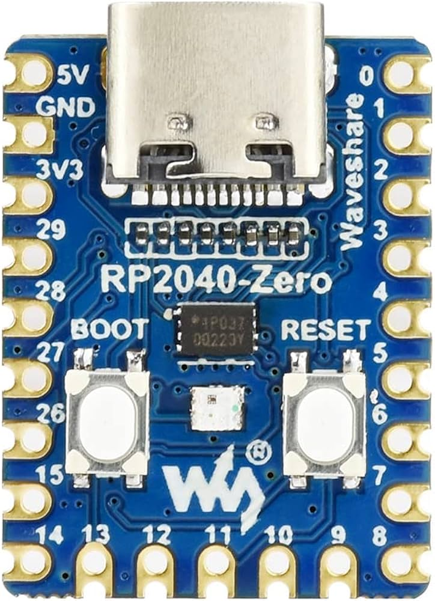

# Wiring & soldering guide

How to solder a MKYADA keypad: **every switch shares one common GND**, and the
switches connect to **GP0, GP1, GP2… in key order**. That's the whole circuit —
no diodes, no resistors, no matrix. The reference build is 6 keys, but the
firmware supports **any count up to 20** — one key per castellated GPIO on the
board's edge.

## Parts

- 1 × Waveshare **RP2040-Zero** (USB-C)
- 1–20 × mechanical switches (Cherry MX or compatible) — 6 is the reference build
- Thin stranded wire (~24–28 AWG), solder, flux
- USB-C **data** cable (some charge-only cables won't enumerate)
- 3D-printed case — STLs and print notes in [case/](case/) (a Stream Cheap
  remix; credits in [case/README.md](case/README.md))

## Know your board

<p align="center">
  
</p>

Hold the board **USB-C connector up, component side facing you**:

```
              ┌───[ USB-C ]───┐
        5V ──│●              ●│── GP0   ← Key 1
       GND ──│●              ●│── GP1   ← Key 2   ★ common ground
       3V3 ──│●              ●│── GP2   ← Key 3
      GP29 ──│●              ●│── GP3   ← Key 4
      GP28 ──│●   RP2040-    ●│── GP4   ← Key 5
      GP27 ──│●     Zero     ●│── GP5   ← Key 6
      GP26 ──│●              ●│── GP6
      GP15 ──│●              ●│── GP7
             │●● ● ● ● ● ● ●●│
              GP14 … GP9   GP8
```

- Key pins follow the board's perimeter: **GP0…GP8 down the right edge**,
  GP9…GP14 along the bottom, then GP15 and GP26…GP29 up the left — 20 usable
  key pins in total. A 6-key build uses just the top six on the right
  (GP0…GP5).
- **GND is the second pad from the top on the left edge** (between 5V and 3V3).
- The onboard WS2812 RGB LED (GP16) is the status light — nothing to wire.
- BOOT/RESET buttons are on the face; you'll use BOOT once when flashing
  CircuitPython ([docs/firmware-install.md](../docs/firmware-install.md)).

## Wiring plan

Each switch has two legs. Which leg goes where doesn't matter — a switch is
just a contact:

```
 Key 1 ──── GP0 ┐
 Key 2 ──── GP1 │
 Key 3 ──── GP2 │        RP2040-Zero
 Key 4 ──── GP3 │
 Key 5 ──── GP4 │
 Key 6 ──── GP5 ┘
 All keys ─ GND (one shared wire)
```

- Key numbering follows the GPIO order: **GP0 = key 1, GP1 = key 2, …**
  Decide now which physical position is "key 1" (top-left is the convention).
- No pull-ups or diodes: the firmware enables internal pull-ups, so a pressed
  key simply shorts its GPIO to GND.
- Any key count from 1 to 20 works: solder GP0…GP(n-1) — keys 7+ continue past
  GP5 onto GP6, GP7, GP8 and around the board — then set the count in the
  setup wizard. (GP16 is skipped: it drives the onboard LED.)

## Soldering, step by step

1. **Plan the layout.** Seat the switches in the case/plate first and decide
   the key order. Cut wires to length with a little slack.
2. **Daisy-chain the ground.** Take one leg of every switch and connect them
   all in a chain with a single wire (strip small gaps in one wire, or bridge
   leg-to-leg). Run the end of the chain to the board's **GND** pad
   (left edge, 2nd from top).
3. **Wire the signals.** The remaining leg of each switch gets its own wire to
   its GPIO: key 1 → GP0, key 2 → GP1, … key 6 → GP5. Tin the pad and the wire
   first; the pads are small, so a fine tip and flux help.
4. **Check for bridges.** The right-edge pads sit close together — inspect
   GP0…GP5 for solder bridges between neighbours. A multimeter in continuity
   mode: every switch should beep between its GPIO and GND **only while
   pressed**, and never beep between two GPIOs.
5. **Strain relief.** A dab of hot glue over the pads saves the joints when a
   wire gets tugged.

## Verify — no multimeter needed

Flash the firmware ([docs/firmware-install.md](../docs/firmware-install.md)),
open the MKYADA app and go to **Setup**: the **live key test** lights up every
key as you press it. If a key doesn't react, reflow its GPIO joint and the
ground chain.

**Soldered the keys in the wrong order?** Don't reach for the iron — the app
fixes it in software: **Setup → Key order (remap)**, press the keys in the
order they *should* be numbered, done. The remap is stored on the keypad, so
standalone mode uses it too.

---

## Türkçe özet

Devre çok basit: **her tuşun bir bacağı ortak GND'ye** (tek zincir hâlinde),
**diğer bacağı sırasıyla GP0, GP1, GP2…'ye** lehimlenir. 6 tuş referans tasarım;
firmware kartın kenarındaki 20 GPIO'ya kadar her sayıyı destekler (GP16 hariç —
o LED'in). GND pad'i USB üstteyken sol
kenarda üstten ikinci; GP0–GP5 sağ kenarda üstten ilk altı pad. Direnç/diyot
gerekmez (firmware dahili pull-up kullanır). Lehim sonrası uygulamadaki
**Setup → canlı tuş testi** ile her tuşu doğrula; tuşları yanlış sırayla
lehimlediysen **Setup → Key order (remap)** ile yazılımdan düzelt — yeniden
lehim gerekmez.
